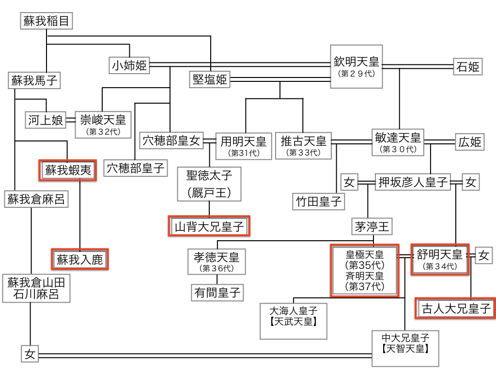

## はじめに

皆さんこんにちは

京都から送る日本史研究の最前線ということで

最初に、争乱と異変の日本古代史を

取り上げたいと思います

日本古代史には

様々な争乱、異変が生じているのですが

それが、これまでに言われているような

解釈や評価でいいのかどうか

最近の研究成果を踏まえながら検証しつつ

私なりの考えを示したいと思っております

最初に取り上げますのは

有名な「乙巳の変（いっしのへん）」という

西暦６４５年６月に

飛鳥板蓋宮という所で生じた政変です

これは、俗に

「大化改新」 と言われることもありますが

正確には「大化改新」というのは

「乙巳の変」というクーデターの後

新たに構築された政権の下で目指された

政治の方向性のことを

「大化改新」と言うわけです

このクーデターを「乙巳の変」と名付けるのが

妥当であるということです

その中身ですけども

当時は皇極天皇という方が在位中でした

皇極天皇は、推古天皇に次ぐ

二代目の女帝として即位された方です

その下で非常に強い政治権力を握っていたのが

蘇我入鹿、大臣という地位にあった人物です

日本書紀の語るところでは

蘇我入鹿があまりにも専制的な、強圧的な政治を行う

特に、天皇や皇室の存在をないがしろにするような

そういう所業が多かったので

肝を煮やした中大兄皇子という皇極天皇の子供が

中臣鎌足らと一緒になって

このクーデターを敢行しました

実際に、蘇我入鹿暗殺に加わる

その仲間というのが

中臣鎌足、蘇我倉山田石川麻呂（そがのくらやまだ の いしかわまろ）

そして実行部隊として

佐伯連子麻呂（さえき の こまろ）、

葛城稚犬養連網田（かつらぎ の わかいぬかい の あみた）

という人物が武器を携えて蘇我入鹿の殺害に向かった

ということになるわけです

なぜ、こういったクーデターが起こったのか

本当に、日本書紀の伝えるように

「蘇我入鹿があまりにも目に余る所業が

多かったのでこれを掣肘（せい ちゅう）した」という

捉え方でいいのかどうかということを

大化改新の前夜から含めて

考えてみたいと思います。

## 起

６２８年に

三十数年の長きに渡って君臨していた

推古天皇、日本最初の女帝が亡くなります

その後、舒明天皇（じょめいてんのう）という男帝が

６２９年に即位します

舒明天皇が６４１年に亡くなると

その妻である皇極天皇

「乙巳の変」が起こった時の天皇です

この天皇が即位したという

こういう運びとなるのですけれども

その際の皇位継承は

決して順調にいったとは言えないもので

実は、推古天皇が亡くなった時に

有力な皇位継承候補者が二人いました

一人は聖徳太子の子供である山背大兄王（やましろのおおえのおう）

有名な厩戸王、用明天皇の子供です

もう 一人が田村皇子という方

この方が舒明天皇（じょめいてんのう）です

山背大兄王というのは

実は、聖徳太子と

蘇我馬子の娘である刀自古郎女という女性

との間にできた子供で

実際に蘇我氏にとってみたら

山背大兄王のほうが血縁的には

蘇我氏の血を色濃く引く人物だったのです

蘇我馬子の弟である境部摩理勢は

山背大兄王の即位を支持していました

ところが、蘇我馬子は既に亡くなっていましたが

その後を継いでいた大臣の蘇我蝦夷は

叔父にあたる境部摩理勢を攻め滅ぼし

結果として

山背大兄王の即位を阻止することになるわけです

そして、蘇我とは直接の血縁関係のなかった

田村皇子、すなわち舒明天皇を即位させた

ということになります

何故そういった判断を

蘇我が下したのかということが

問題になってくるわけです

そのすぐ後、皇極天皇が即位されて2年後に

時の権力者、蘇我入鹿は

山背大兄王のもとに軍勢を送り込み

山背大兄王だけではなく

聖徳太子の血縁に繋がる人を

ことごとく殺害したという事件が起こります

これが「上宮王家滅亡事件」という

西暦６４３年に生じた事件です

このことによって

蘇我氏の 先権・先王というものが

あからさまになり

危機感を募らせた中大兄皇子が

蘇我入鹿、暗殺を企てるに至ったという経緯で

日本書紀は語っているのですが

これが本当かということなのです

実は、平安時代に編纂された

「聖徳太子伝補闕記」という書物があります

「聖徳太子伝補闕記」の中に

非常に興味深い記事があります

上宮王家滅亡には蘇我入鹿だけではなく

その父親である蘇我蝦夷、軽王（孝徳天皇）

巨勢徳太、大伴馬甘、中臣塩屋枚夫

こういった面々が加わっていたと

伝えているわけです

日本書紀は

蘇我蝦夷は自分の子供である蘇我入鹿の所業を

「非常に危険な事をしたと嘆いた」というふうに

いかにも、蘇我入鹿、単独の犯行である

というかたちで捉えているのですが

皇位継承の有力候補者であった人物と

その一族を、殲滅（せんめつ）する

というような大それた事件が

たった一人の有力者の判断だけで

なし得るものかということについては

やや疑念が抱かれます

そればかりか、もっと注目したいのは

このメンバーの中に

「軽王」が加わっていたということです

軽王という方は、軽皇子（かるのみこ）

この方は「乙巳の変」のクーデターの後

新たに構築された

「大化の新政府」と呼ばれる政権の

一番中心になり、すなわち即位し

「孝徳天皇」という天皇になった方です

大化改新の新たな政策は

実は、この方を中心に展開されます

日本書紀には

中大兄皇子が一番の有力者であった

と書いてありますが

最近の研究ではそうではなく

大化改新の際の

新たな政治改革の方向性を決したのは

孝徳天皇の意向が強く反映したと言われています

そうなってくると

「乙巳の変」というクーデター自体も

やや考え直す可能性があります

この二つの皇室の系というのは、単に

今で言う「宮家」のようなものがあっただけでなく

山背大兄王の上宮王家

そして、舒明天皇の彦人大兄皇子の系統

それぞれが

自分たちの独自の土地と人々を支配していました

それぞれの皇室の財産が

分割統治されるようなかたちで存在したのが

当時の形態でありました

そういった形態である以上

朝廷が一丸となって新しい体制をつくることは

なかなか困難な状況にあります

天皇の代替わりごとに

いろんな問題が生じることになってくるのです

当時、東アジア社会は非常に激動の時代で

新たに、隋・唐という中国を統一した大帝国

その下で影響を受けてきた朝鮮半島には

高句麗・百済・新羅という王朝があり

当然、そういった東アジアの情勢に

日本も対応していかなければならない

そのためには、まず日本国内の一体化

統一を図らなければならない

という方向性があった時に

蘇我氏が判断したのは血縁的には濃い

上宮王家の山背大兄王を即位させるのではなく

舒明天皇、彦人大兄皇子の系統を中心として

一体化させようと動いたと考えます

そう考えてみると「上宮王家滅亡」という事件は

皇統の一元化と朝廷の一体化

そのための方向性を目指す中で生じた事件として

捉えるべきであり

当時の東アジア情勢を十分に勘案しながら

その評価を下すべきであり

決して、 蘇我入鹿の単独犯行

彼自身の先見の成せる事件である

というようなかたちで受け止めるのは

ややおかしい

再考を要するのではないか

というふうに考えられているのが

最近の研究成果であると思います

ありがとうございました
